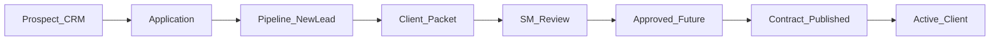

# Nzinga Talent OS — Platform capabilities

Nzinga Talent OS (also branded as Talent Manager X) is a multi-tenant talent operating system. It takes a person from first contact through application, vetting, Client Packet, contract, and active roster, and it gives the agency the CRM, communications, tickets, accounting, and reports needed to run day-to-day operations.

This file is the product capability catalog. Setup and development live in [README.md](README.md). Unshipped work lives in [TODO.md](TODO.md).

## How to keep this file current

- Update this file in the same change that ships a user-visible capability.
- Add or revise a bullet under the matching section below.
- Change the lifecycle diagram only when the SOP path itself changes.
- If a nav item or row action is still a stub, say so in that section rather than deleting the feature.

---

## Who uses it

| Audience | How they get in | What they do |
|---|---|---|
| **Staff** | Company code, then email and password or Continue with Google | Run CRM, pipeline, packets, contracts, finance, and admin |
| **Prospects** | `/portal` with an access code (or start a new application) | Fill the NZG short application |
| **Guardians** | `/guardian/verify` magic link | Confirm a minor applicant |
| **Signed talent** | `/talent/login` then `/talent/*` | Home, activity, money, files (DocHub sign), messages, settings |

### Staff roles

System roles keep stable slugs. Directors can create additional roles with their own pipeline stages, module access, and permissions.

| Role | What they are for |
|---|---|
| **Scouting Agent** (`scout`) | Identify and qualify prospects. Send applications. Assemble a Client Packet. Do not approve representation or negotiate contracts. |
| **Account Manager** (`account_manager`) | Finance, escrow, invoices, retainers, payday. Open workspace. |
| **Success Manager** | QA Client Packets, approve as **Approved - Future**, publish contracts, onboard signed clients. |
| **Director** | Full pipeline, admin (users, roles, settings), and executive decisions. |

Permissions that gate SOP actions: send application, submit Client Packet, track own submissions, approve packet, return packet, publish contract, admin access.

---

## End-to-end lifecycle

**SOP sub-status** (shown on the pipeline record and CRM prospect) moves forward and does not rewind when an earlier event re-syncs:

1. New / Lead
2. Application Submitted / Under Vetting
3. In Manager Review
4. Approved - Future
5. Contract Published / Pending Signature
6. Active

**Pipeline stages** (the columns staff work) use these product labels:

| Stage key | Label |
|---|---|
| `holding_entry` | New / Lead |
| `scout_complete` | More Information Required |
| `team1_review` | Client Packet Review |
| `ops_processing` | Success Manager Validation |
| `team2_audit` | Contract Pending |
| `executive_review` | Director Review |
| `signed_onboarding` | Active Client |
| `archived` / `not_viable` | Archived / Declined |

Typical happy path:

1. Staff create a prospect (or a holding entry) and send an application. Known name, email, phone, DOB, location, and work area autofill the form.
2. The prospect completes and submits. Staff **Import to Pipeline** (or auto-upgrade on 100% submit) lands them at **New / Lead** as **Application Submitted / Under Vetting**.
3. The Scouting Agent scores Jordan pillars, records Discovery Call notes, collects government ID, and **Submit Client Packet to Success Manager**.
4. Success Manager QA: approve → CRM **Approved - Future** (Team 1 Lead can still Approve into ops on the legacy path).
5. Success Manager publishes the contract and notifies the prospect.
6. The prospect signs in the talent portal (in-app name confirmation). The record becomes an **Active Client**.

Each role only sees the pipeline stages they are allowed to act on. Scouts who submitted a packet can track that record downstream as read-only.

---

## Capability catalog

### Auth and tenancy

- Company code selects the tenant (NZG, NZINGA, TCG). Staff then sign in with email and password.
- Signup confirmation, password reset, and guardian links are sent by Supabase Auth (custom SMTP).
- Per-user settings: display name/title, light/dark theme, sidebar preference, password reset request.
- Command Launch in the top nav finds people, applications, and pages. Pages match by title or path substring, not by letter-sequence matches against names (searching “Rico” does not suggest Applicant Pool).
- Header **SMS icon** with an unread-thread badge opens the Text Messaging Center (`/messaging`).
- Staff **My Workspace** home uses larger welcome, Favorites, Reports, and group titles.
- Twilio (not RingCentral) will power click-to-call and SMS. Until the vendor is live, Settings, the Text Messaging Center, and talent-record Call/SMS show **Coming soon** and send stays disabled. Staff notices mention [EXTERNAL_ATTENTION.txt](EXTERNAL_ATTENTION.txt); talent and brand portals do not.
- TOTP MFA is configured in Supabase Auth; demo mode shows it as coming soon.

### Open workspace

- Four system roles: Scouting Agent, Success Manager, Account Manager, Director. All four see every module and pipeline stage. Only Director can open `/admin/users` and `/admin/roles`. SOP still locks incomplete Client Packet submit.

### Prospect CRM

- Create a prospect (name, email, DOB, division, source, assigned agent; parent contacts required for minors).
- Prospects list, merge, stage changes, notes, and a **Prospect Tracking Board**.
- **Send Application** from a prospect, talent record, New Entry, or applicant profile. Already-entered information maps into the matching application fields; staff notes are not copied.
- Application status keeps the CRM prospect in sync (sent → started → pending parent → completed) without overwriting a later SOP status such as Approved - Future.
- A few row actions still show **Coming soon** (for example some bulk/communication stubs on the prospects list).

### Applications

- NZG short application: Basic Information, Representation Interest, About You, then conditional Modeling / Acting / Sports / Influencing sections, Representation & Conflicts, Availability, Social & Portfolio, ID Verification, Final & Signature.
- Access-code lookup, autosave, file uploads to Amazon S3 (with a cropper for profile photos and headshots), duplicate-email protection, and guardian flow for minors.
- Staff Applications list with progress, filters (in progress, pending parent, ready to import, incomplete), and applicant account profile.
- **Import to Pipeline** only for complete submitted apps (not pending guardian). Opens the pipeline record as **Application Submitted / Under Vetting** and does not rewind a later SOP stage.

### Pipeline and talent record

- Pipeline views (tables / kanban). Open workspace shows all stages to the four roles.
- Talent record includes a **Screening Workspace** (review → Jordan Score → Discovery Call → safety screening → recommendation → submit). Initiate screening shows **Coming soon** until a provider is live. Submit stays locked until every required step is done; the missing list is shown in plain language.
- **Jordan Score**: five pillars, each 1–5 with written rationale; all ≥ 3 and average ≥ 3.5 to advance.
- Scout Client Packet gate: Jordan Score, Discovery Call notes, government ID, application review, safety screening status, and Scout recommendation.
- History / Notes: categories General, Communication, Opportunity, Internal. Table of Type / Date / Note / Category / User. Mass email and SMS write a row onto every recipient.
- Right-hand **quick action bar** on account profiles (add note, renew, issue, email, SMS, invoices).
- Documents: government ID, tax, banking, proof of income, plus application uploads. Files are stored in Amazon S3.

### Contracts and onboarding

- Success Manager (or Director) **publish contract**. Signing is **DocHub only** (in-app name confirmation removed). Until DocHub is live, Create & Send stays disabled and staff/talent/brand contract screens show **Coming soon**.
- Renew opens a term form (6 months–3 years), previews the template (Division, Contract, Current % Rate), then sends via DocHub.
- On executed signature the CRM prospect becomes a **Clients · Active** roster record.

### Clients / roster

- Shared account profile: compact header, widget grid, History ledger, and sticky right-hand actions (no cluttered horizontal action row).
- UDF (user-defined roster fields) is staff-maintained; application answers prefill empty fields only.
- Clients list with lifecycle (current / future / past), contracts, and account number.
- **Brands** directory and **Brand portal** (`/client/*`) for invoices, contracts, and projects. Pay Invoice and e-sign show **Coming soon** until Stripe and DocHub are live.

### Communication

- **Send Email** composer for 1:1 and blasts. **Send Individually** is required so recipients never see each other. Each send writes History per recipient. Resend Edge Function.
- **Text Messaging Center** two-pane inbox. Twilio when connected; otherwise a **Coming soon** notice and Send stays off.
- Header phone icon jumps to `/messaging`.
- Talent record: click-to-call and SMS via Twilio when connected.

### Client services

- Support tickets: staff New Issue modal (Description / Links / Details / Dates) and a short talent/brand portal form. Dashboard lists Issue ID, age, status, talent, division.
- Agency tasks with assignees, due dates, recurrence, and History on create/complete.
- Interactive calendar (month / week / day / agenda) sharing one data model with Appointments. Portal self-scheduling respects agency hours and blocks overlaps. Google/Outlook sync shows **Coming soon**.

### Accounting

Open workspace: all four roles can open finance modules. SOP still requires cleared escrow before **Approve & Execute**.

- Client invoices, recurring retainers, overdue interest, batch receipts.
- Record escrow / deposit, **Bank Reconciliation** (Post disabled until Difference is $0.00). Live Plaid feeds and Chase balances show **Coming soon**.
- Log expense / payout, vendors, disbursements, issue talent payouts, **Payout Approvals**. Approve & Execute / Execute payout stay off until Chase ACH is live.
- Gross bookings report uses a 20/80 split on invoice amount (agency commission vs talent share).

### Reports

**My Reports** uses a parameter launcher (Division, date range) then **Run Live View**:

- Roster & booking: roster scorecard, applicant pool & pipeline log, onboarding & offboarding, roster openings, escrow balances.
- Receivables: gross bookings & commission (fixed 20/80), AR aging, overdue accounts.
- Payables: pending talent payouts.

### Admin

Directors only: `/admin/users` (Team Members) and `/admin/roles`.

- Tabbed System Settings (Company Codes, General, Email, Financial). Financial tab shows **Coming soon** for Stripe, Plaid, and Chase until those vendors are live.
- **TMX University** at `/university` (workspace Academy link). Role learning paths plus training videos.
- Team Members (`/admin/users`): search, invite, job title, active toggle, four-role badges.
- Staff layouts use breakpoints at 1280px (desktop), 768–1279 (tablet), and under 768 (mobile): stacked launchers, horizontally scrolling tables. On phones the staff sidebar hides, TopNav collapses extras into search + menu + profile, the full menu stacks, and the profile quick-action rail becomes a bottom bar. Staff talent and applicant account pages fill the remaining viewport height and keep extra bottom padding so the last section can be scrolled into view. Talent and brand portals stack cards and keep 44px tap targets.

### Talent portal

Signed clients (and approved prospects waiting to sign) use `/talent`:

- **Home** — status, agent, calendar, trust/earnings snapshot.
- **Activity** — appointments and related events.
- **Money** — invoices, commissions, payout request when tax/banking are ready.
- **Files** — documents and DocHub signing when a contract is published (no in-app name sign). Open in DocHub stays disabled with **Coming soon** until e-sign is live.
- **Messages** — support request form (Payment, Contract, Booking, Profile, Other).
- **Settings** — portal preferences. Direct-deposit bank linking shows **Coming soon** until Plaid is live.
- Full-width layout with denser cards. Below 768px the nav is off-canvas.

### Brand portal

Corporate reps use `/client/login` then dashboard, projects, invoices (Pay Invoice **Coming soon** until Stripe), and contracts (e-sign **Coming soon** until DocHub). Demo login still works.

---

## Operations updates

- Staff sessions stay signed in for 15 minutes of inactivity.
- Create and edit dialogs use **Save and New** and **Save and Finish**.
- Executed talent payouts show as **Paid**. Payment methods are ACH, Wire, and Check.
- The workspace announcements line opens an announcements page. Directors can add, edit, and remove announcements.
- Create Prospect asks for first name, email, organization, and date of birth, then emails the application link. People stay off the Prospects list until the application is complete.
- Prospect email from the row menu opens in place. Renewal offers are 1 year. If there is no existing representation, commission and division can change.
- Tracking-board cards show last contact, next contact, and agent. The name opens the profile.
- Support tickets open on Unassigned. Ticket rows open the detail dialog. Client Services no longer lists a second New Ticket or TMX University item.
- Reports can be downloaded as PDF, Excel, CSV, text, or HTML. Roster openings show four divisions at a 50-person cap for the current semester.
- System Settings includes agency catalogs, contract end-date shifts, and open-ended contracts.
- Staff can sign in with Google through Supabase after the company code. The Google account must already belong to a staff user for that company.

## Related docs

- [README.md](README.md) — install, demo mode, tech stack
- [TODO.md](TODO.md) — remaining product to-dos
- [EXTERNAL_ATTENTION.txt](EXTERNAL_ATTENTION.txt) — vendor accounts (Twilio, DocHub, Stripe, Plaid, Chase, screening)
- [SUPABASE_SETUP.md](SUPABASE_SETUP.md), [EDGE_FUNCTIONS_SETUP.md](EDGE_FUNCTIONS_SETUP.md) — integrations
